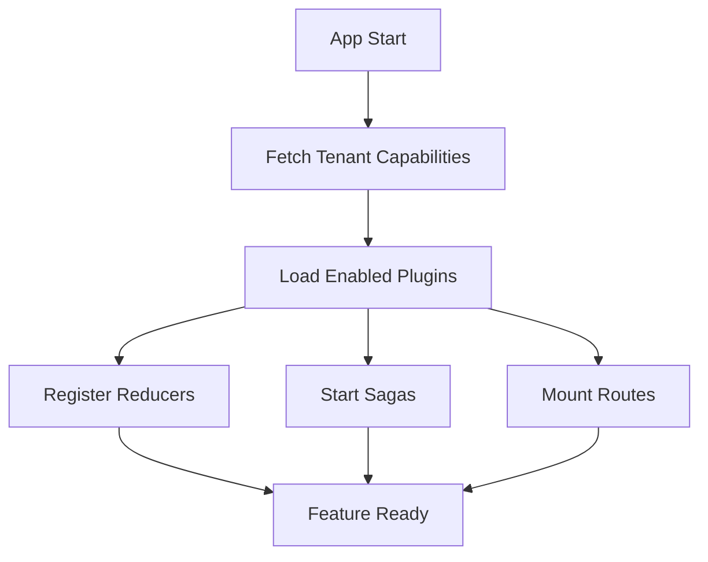

# Convera Dental Main UI - Project Summary

## Overview

This React application implements a sophisticated **dynamic module loading system** for a multi-tenant dental practice management platform. The architecture enables features to be loaded on-demand based on tenant capabilities, creating an efficient and scalable plugin-based system.

## Core Architecture

### 🏗️ Plugin-Based Architecture

The application is built around a plugin system where features are:
- **Dynamically loaded** based on tenant capabilities
- **Code-split** into separate chunks for optimal loading
- **Self-contained** with their own Redux state, sagas, and routes
- **Capability-guarded** to ensure proper access control

### 🔄 Dynamic Loading Flow



## Key Components

### 1. Plugin Registry (`/src/plugin-registry/`)

**Main Registry (`index.ts`)**
- Defines `PluginModule` interface with standardized plugin structure
- Maps feature keys to dynamic imports for code splitting
- Each plugin is lazy-loaded as a separate chunk

```typescript
export type PluginModule = {
  featureKey: string;
  getRoutes: (basePath: string) => Promise<RouteObject[]>;
  getReducers?: () => Promise<Record<string, Reducer>>;
  getSagas?: () => Promise<(() => Generator)[]>;
};
```

**Capabilities System (`capabilities.ts`)**
- Fetches tenant-specific feature permissions from API
- Determines which plugins should be loaded
- Supports different subscription plans and feature enablement

**Access Guards (`guards.ts`)**
- Implements capability-based route protection
- Redirects unauthorized access attempts
- Integrates with React Router loaders for seamless protection

### 2. Dynamic State Management (`/src/app/`)

**Store Configuration (`store.ts`)**
- Configures Redux store with reducer and saga managers
- Exposes managers to plugins for dynamic registration
- Maintains clean separation between core and plugin state

**Reducer Manager (`reducerManager.ts`)**
- Enables runtime addition/removal of Redux reducers
- Rebuilds combined reducer when plugins are loaded
- Prevents state conflicts between features

**Saga Manager (`sagaManager.ts`)**
- Manages Redux-Saga lifecycle for plugins
- Tracks running sagas to prevent duplicates
- Enables saga cancellation when features are unloaded

### 3. Feature Host (`/src/app/featureHost.tsx`)

The orchestrator that:
1. **Fetches tenant capabilities** on application boot
2. **Loads enabled plugins** dynamically
3. **Registers plugin reducers** with the store
4. **Starts plugin sagas** for side effects
5. **Mounts plugin routes** under their base paths
6. **Builds final route tree** combining static and dynamic routes

### 4. Plugin Implementation (`/src/plugins/doctor/`)

Example plugin structure demonstrating:

**Plugin Manifest (`index.plugin.ts`)**
- Exports standardized plugin interface
- Lazy-loads all plugin components and logic
- Defines route structure with nested layouts

**Modular Structure:**
- `core/` - Shared logic and guards
- `ui/` - Layout components and UI elements
- `inchair/` - Feature-specific modules
- `aftervisit/` - Additional feature modules

## Technology Stack

### Frontend Framework
- **React 19** - Latest React with concurrent features
- **TypeScript** - Full type safety across the application
- **Vite** - Fast build tool with excellent code splitting

### State Management
- **Redux Toolkit** - Modern Redux with RTK Query integration
- **Redux-Saga** - Advanced async flow control
- **Dynamic Registration** - Runtime state management

### Routing & Loading
- **React Router 7** - Latest routing with data loading
- **Lazy Loading** - Component-level and route-level code splitting
- **Loader Functions** - Data fetching and access control

### Styling & UI
- **Tailwind CSS** - Utility-first styling framework
- **Responsive Design** - Mobile-first approach

## Dynamic Loading Benefits

### 🚀 Performance Optimization
- **Initial Bundle Size**: Only core features loaded initially
- **Code Splitting**: Each plugin becomes a separate chunk
- **Lazy Loading**: Features loaded only when accessed
- **Tree Shaking**: Unused plugin code never downloaded

### 🔐 Security & Access Control
- **Capability-Based Loading**: Features loaded based on permissions
- **Route Guards**: Automatic access control at route level
- **API Integration**: Real-time capability checking

### 🏢 Multi-Tenancy Support
- **Feature Toggling**: Different features per tenant/plan
- **Scalable Architecture**: Easy to add new features
- **Subscription Management**: Feature access tied to billing

### 🔧 Developer Experience
- **Modular Development**: Teams can work independently on features
- **Hot Module Replacement**: Fast development iterations
- **Type Safety**: Full TypeScript support across plugins
- **Clean Architecture**: Clear separation of concerns

## Plugin Development Pattern

### 1. Plugin Structure
```
plugins/[feature-name]/
├── index.plugin.ts          # Plugin manifest
├── core/                    # Shared logic
│   ├── [feature]Slice.ts   # Redux state
│   ├── sagas/              # Side effects
│   └── guards.ts           # Route protection
├── ui/                     # Components
│   └── Layout.tsx          # Feature layout
└── [subfeatures]/          # Feature modules
    ├── components/
    ├── pages/
    └── hooks/
```

### 2. Plugin Registration
```typescript
// Add to plugin registry
export const pluginRegistry = {
  [featureKey]: () => import('@/plugins/[feature]/index.plugin'),
};
```

### 3. Capability Configuration
```typescript
// API returns tenant capabilities
{
  "enabled": ["doctor", "billing"],
  "plan": "premium"
}
```

## Routing Architecture

### Static Routes (Always Available)
- `/` - Landing page
- `/login` - Authentication
- Error boundaries and fallbacks

### Dynamic Routes (Capability-Based)
- `/doctor/*` - Doctor workflow features
- `/billing/*` - Billing management
- `/inventory/*` - Inventory tracking
- *Additional features as enabled*

### Route Protection
- **Loader-based guards** check capabilities before route activation
- **Automatic redirects** for unauthorized access
- **Pre-loading optimization** for authorized features

## Build & Deployment

### Development
```bash
npm run dev          # Start development server with HMR
npm run build        # Production build with optimizations
npm run preview      # Preview production build
```

### Build Optimizations
- **Automatic code splitting** by plugin
- **Tree shaking** removes unused code
- **Asset optimization** for faster loading
- **Source maps** for debugging

### Bundle Analysis
The plugin system creates optimal bundles:
- **Core bundle**: React, Redux, routing essentials
- **Plugin bundles**: Feature-specific code
- **Shared chunks**: Common dependencies
- **Asset bundles**: Images, fonts, styles

## Future Enhancements

### 🔄 Runtime Plugin Updates
- Hot-swapping plugins without full page reload
- A/B testing different plugin versions
- Gradual rollouts of new features

### 📊 Analytics Integration
- Plugin usage tracking
- Performance monitoring per feature
- User behavior analytics by capability

### 🔌 External Plugin Support
- Third-party plugin development
- Plugin marketplace
- Sandboxed plugin execution

### 🌐 Micro-Frontend Evolution
- Independent deployment of plugins
- Cross-domain plugin loading
- Plugin versioning and compatibility

## Conclusion

This dynamic module loading system provides a robust foundation for building scalable, multi-tenant SaaS applications. The architecture balances performance, security, and developer experience while enabling rapid feature development and deployment.

The plugin-based approach ensures that the application can grow efficiently, with new features being added as independent modules without affecting the core system or other plugins. This makes it ideal for complex business applications where different tenants may require different feature sets based on their subscription plans or specific needs.